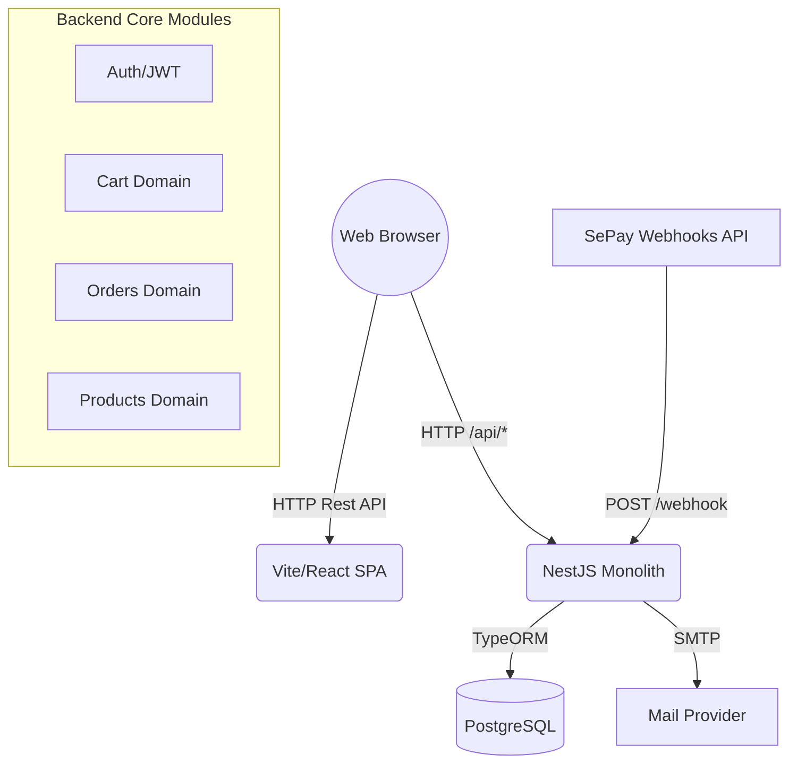

# Laptop E-commerce Web App
<p>
  
  
  
  
  
</p>

Full-stack e-commerce web application specialized for selling laptops. Built with React (Vite + TailwindCSS + shadcn/ui) on the frontend and NestJS + TypeORM + PostgreSQL on the backend. Supports JWT authentication, product/catalog management, cart, orders with rank-based discounts, SePay QR payments (and COD), product reviews, an admin dashboard, and transactional email.

---

## Table of Contents

- [Project Overview](#project-overview)
- [Features](#features)
- [Architecture & Design Decisions](#architecture--design-decisions)
- [Tech Stack & Dependencies](#tech-stack--dependencies)
- [Project Structure & Key Modules](#project-structure--key-modules)
- [Setup & Installation (Docker & Local)](#setup--installation-docker--local)
- [Environment Variables](#environment-variables)
- [Usage Code Examples](#usage-code-examples)
- [API Overview](#api-overview)
- [Payments (SePay)](#payments-sepay)
- [Security Notes](#security-notes)
- [Development Guidelines](#development-guidelines)
- [Troubleshooting](#troubleshooting)
- [Testing](#testing)
- [Demo Accounts](#demo-accounts)
- [Contributing](#contributing)
- [Roadmap](#roadmap)

---

<!-- Updated: Expanded Project Overview -->
## Project Overview

This project provides a comprehensive foundation for an e-commerce platform catered specifically to electronic goods like laptops. 

**Problem it solves:** Providing a complete out-of-the-box shop experience that handles dynamic catalog filtering, shopping cart persistence, role-based access control, tiered user discounts (Bronze, Silver, Gold, Diamond), and native Vietnamese QR banking payments via SePay integration out of the box.

---

## Features

- **Authentication & Authorization:** Register/Login, JWT access + refresh tokens, role-based guards (User/Admin).
- **Products & Categories:** CRUD (admin), listing, product details, search/filter (by category), pagination.
- **Cart:** Persistent cart for logged-in users, add/update/remove items.
- **Orders:** Create from cart, view history/details, cancel order; rank-based discounts (Bronze/Silver/Gold/Diamond → 0%/5%/10%/20%).
- **Payments:** SePay QR code generation, webhook handling, COD support; switch payment method for an order.
- **Reviews:** 1–5 stars with comments; only for purchased products; average rating per product.
- **Admin:** Dashboard with summary and detailed stats; user/product/order management endpoints.
- **Mail:** Welcome email on successful registration (EJS templating).

---

<!-- Updated: Added Mermaid diagram and reasoning -->
## Architecture & Design Decisions

The application follows a **Monolithic Client-Server Architecture** featuring strict Separation of Concerns.



**Key Design Decisions:**
1. **Modular Monolith:** Kept deployment simple in a single backend instance, but heavily isolated domains internally (using Clean Architecture patterns like `controllers`, `services`, `usecases`, `dtos`) within NestJS. This enables easy extraction into microservices later if scaling demands it.
2. **Client-side Routing & Server State:** The React SPA uses `react-router-dom` for application views and `TanStack Query` for caching backend state, significantly reducing complex Redux/Zustand global stores to only local UI state.

---

<!-- Updated: Added 'Why these choices?' explanations -->
## Tech Stack & Dependencies

- **Backend:** 
  - **NestJS 11** & **TypeScript:** Strict typing and extensive decorators pattern. 
  - **TypeORM & PostgreSQL:** Highly reliable relational data integrity for e-commerce transactions. 
  - **Bcrypt & JWT:** Stateless secure sessions. 
  - **@nestjs-modules/mailer (EJS):** Easy templating for transactional emails.
- **Frontend:** 
  - **React 19 & Vite 6:** Modern, lightning-fast HMR and build tools. 
  - **TailwindCSS 4 & shadcn/ui:** Beautiful, highly-customizable atomic component designs that are owned by the repository rather than opaque libraries.
  - **Zustand 5 & TanStack Query 5:** Minimal boilerplate for client state, paired with robust automated caching/refetching for server data.
- **Infra:** Docker & Docker Compose for normalized Dev/Prod parity.

---

<!-- Updated: Detailed key module paths -->
## Project Structure & Key Modules

### High-level Structure

```
Web-Ecom/
├── backend/                  # NestJS API Engine
│   └── src/
│       ├── auth/             # JWT, Guards, Strategies
│       ├── cart/             # Shopping Cart Entity & Sessions
│       ├── orders/           # Checkout, Rank Discounts, Order History
│       ├── payments/         # SePay Integration & COD
│       ├── products/         # Catalog CRUD & Search
│       ├── reviews/          # Customer Feedback
│       └── mail/             # EJS Templates & Transporter
├── frontend/                 # React SPA
│   └── src/
│       ├── components/       # Shadcn UI primitives & custom components
│       ├── hooks/            # Custom React Hooks
│       ├── pages/            # Routable application views
│       ├── services/         # Axios API wrapper functions
│       └── stores/           # Zustand global state
└── docker-compose.yml        # Orchestration definitions
```

---

## Setup & Installation (Docker & Local)

### Quick Start (Docker)
Prerequisites: Docker and Docker Compose installed.

```bash
# From project root
docker compose up -d
```

Services (defaults):
- **Frontend:** http://localhost (mapped 80:80)
- **Backend API:** http://localhost:3000
- **Swagger Docs:** http://localhost:3000/api/docs
- **PostgreSQL:** localhost:5432 (user: ecom_user, db: ecom_db)

*Note: The compose file sets default JWT and SMTP placeholders. Change them for production deployments. Uploaded files are persisted via volume: `./backend/uploads → /app/uploads`.*

### Local Development

**Option A — Run everything with Docker (recommended)**
Same as Quick Start. Container volumes are mapped for hot-reloading.

**Option B — Run DB with Docker, FE/BE locally**

```bash
# Start only Postgres from compose
docker compose up -d postgres
```

**Backend (NestJS)**
```bash
cd backend
pnpm install
# Ensure .env or .env.development is created (see vars below)
pnpm dev       # Start in watch mode (http://localhost:3000)
pnpm seed      # Seed sample data
```

**Frontend (React)**
```bash
cd frontend
pnpm install
# Ensure .env is created with VITE_API_URL=http://localhost:3000
pnpm dev       # Start Vite dev server
```

---

<!-- Updated: Converted Configuration to tables -->
## Environment Variables

### Backend (`backend/.env.[environment]`)

| Variable | Description | Example |
|---|---|---|
| `NODE_ENV` | Application environment phase | `development` / `production` |
| `PORT` | API Server Port | `3000` |
| `DATABASE_*` | Postgres Database Credentials connection config | `localhost`, `5432`, `ecom_user`, `ecom_db`|
| `JWT_SECRET` | Cryptographic signature key | `replace-with-a-strong-secret` |
| `JWT_EXPIRATION_TIME` | Access Token lifetime | `1h` |
| `JWT_REFRESH_EXPIRATION_TIME`| Refresh Token lifetime | `7d` |
| `MAIL_HOST` / `SMTP_*` | Target SMTP server & credentials for transactional mail | `smtp.gmail.com` |
| `SEPAY_*` | Variables for generating SePay Bank QR | `SEPAY_BANK_CODE=VCB` |

### Frontend (`frontend/.env`)

| Variable | Description | Example |
|---|---|---|
| `VITE_API_URL` | The base URL for the backend API queries | `http://localhost:3000` |

---

<!-- Added: Requested Usage Code Examples -->
## Usage Code Examples

### 1. Creating an Order (Frontend API Service)
```typescript
import api from './api';

export const createOrder = async (payload: CreateOrderRequest) => {
  // Makes an authenticated POST request to generate an order from cart
  const response = await api.post('/api/orders', payload);
  return response.data; // Includes the Order details and a possible SePay QR URL
};
```

### 2. Processing Webhooks (Backend SePay Integration)
```typescript
@Post('webhook/sepay')
async handleSePayWebhook(@Body() payload: SePayWebhookDto) {
  // The webhook provider sends banking transfer success events
  // The application verifies the signature in production, then triggers fulfillment
  return await this.paymentsService.processSePayWebhook(payload);
}
```

---

## API Overview

- **Auth:** `POST /api/auth/register`, `POST /api/auth/login`, `POST /api/auth/refresh-token`
- **Products & Categories:** `GET /api/products`, `GET /api/products/:id`, `GET /api/categories`
- **Cart:** `GET /api/cart`, `POST /api/cart/items`, `PUT /api/cart/items/:productId`, `DELETE /api/cart/items/:productId`
- **Orders:** `POST /api/orders`, `GET /api/orders`, `GET /api/orders/:orderId`, `DELETE /api/orders/:orderId/cancel`
- **Payments:** `POST /api/payment/create`, `POST /api/payment/webhook/sepay`, `GET /api/payment/methods`, `POST /api/payment/switch/:orderId`
- **Admin:** `GET /api/admin/orders`, `PATCH /api/admin/orders/:orderId/status`, `GET /api/admin/dashboard/summary`

*For full definitions, navigate to `http://localhost:3000/api/docs` while the application is running to view the interactive Swagger Documentation.*

---

## Payments (SePay)

- **QR Generation:** Builds an image URL (`https://qr.sepay.vn/img?...`) referencing the order correlation code (e.g., `DH{orderId}`).
- **Webhook Verification:** Enabled if `SEPAY_WEBHOOK_SECRET` is set. By default bypassed for ease of local development.
- **Provider Restrictions:** SePay public API mandates a 2 calls/second rate limit; backend service automatically queues/paces rapid requests.

---

## Security Notes

1. **Always rotate credentials:** Change all secrets (`JWT_SECRET`, SMTP credentials, SePay keys, Database Passwords) prior to staging/production deployments.
2. **Transfer Channels:** Run under secure TLS/HTTPS mechanisms only in production.
3. **Webhook Safety:** Ensure the webhook provider endpoints are verified against IP scopes or secrets.

---

<!-- Added: Development Guidelines section -->
## Development Guidelines

- **Code Style:** Prettier is used for formatting. For consistency, use `pnpm run format` (if available) before committing.
- **Component Architecture:** Add new UI elements to `frontend/src/components` following the atomic design principles applied via shadcn UI.
- **Backend Modularity:** When writing new features (e.g., "Wishlist"), create a new isolated directory inside `backend/src/` containing `controllers`, `services`, `dtos`, and `entities`. Avoid cross-domain coupling.

---

<!-- Added: Troubleshooting section -->
## Troubleshooting

| Issue | Potential Solution |
|---|---|
| **E2E/API Connection Refused** | Ensure Docker backend container is bound to `3000`. Double check `VITE_API_URL` in frontend `.env`. |
| **SePay Webhook Failing** | If `SEPAY_WEBHOOK_SECRET` is set in development, make sure the mock webhook contains the correct HMAC-SHA256 signature algorithm. |
| **Blank Product Images** | Check if the backend volume `./backend/uploads:/app/uploads` is correctly mapped in your docker-compose.yml, and ensure the folder actually exists locally. |

---

## Testing

Currently, test boilerplates exist structurally across the repositories. Manual testing endpoints exist inside Postman exports (if generated) and via the Swagger documentation link. 

Future automated testing plans include:
- `Jest` / `Supertest` specs for Backend Use Cases & API Layers.
- `Vitest` unit tests and `Playwright` E2E flows for Frontend.

---

## Demo Accounts (Seeded Data)

For rapid evaluations on cloned repositories where `pnpm seed` has been run:
- **Admin:** `admin@gmail.com` / `admin123`
- **Customer:** `customer@gmail.com` / `123456789`

---

<!-- Added: Contributing section -->
## Contributing

1. Fork the Repository
2. Checkout a new feature branch (`git checkout -b feature/awesome-addition`)
3. Commit your changes with descriptive semantics (`git commit -m "feat: adding new wishlists module"`)
4. Verify changes locally following the [Development Guidelines](#development-guidelines)
5. Push to the branch & open a Pull Request!

---

## Roadmap / Future Work

- [ ] ML-based product recommendations & RAG Chatbot implementations.
- [ ] Advanced search mechanisms mapped through Elasticsearch or PG-Trigram.
- [ ] Incorporate additional Payment Gateways (VNPay, MoMo, ZaloPay).
- [ ] Improved generic mobile PWA UX / Service Workers routing.

---

<p align="center">
  MIT &copy; HaoNgo232
</p>
